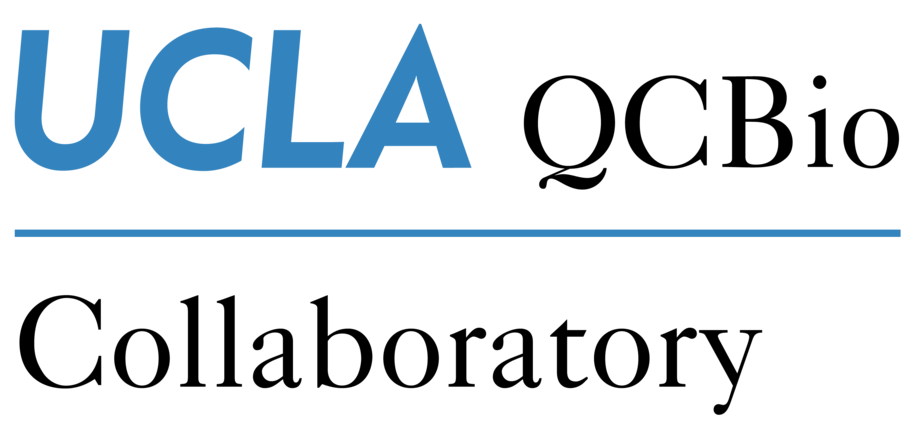

# UCLA QCBio Collaboratory Workshop W3: Introduction to R and Data Visualization
Author: Wenbin Guo \
Last Update: 2024 Spring

## Description
This introductory workshop is designed to equip participants with essential skills in R programming and data visualization. In this workshop, attendees will explore R fundamentals, delve into advanced programming topics, and learn data wrangling and visualization using the `tidyverse` toolkit (https://www.tidyverse.org/packages/). By the end of the workshop, participants will be comfortable with R’s core features, able to write simple programs, and capable of creating foundational data visualizations. For registration information, please refer to this [link](https://qcb.ucla.edu/collaboratory/workshops).

## Schedule
This workshop is taught every quarter (3-day workshop, 3 hours per day).

Day 1: R Basics
- R/RStudio environment setup
- Introduction to variables and operators in R
- Overview of key data structures: Vector, Matrix, List, Data frame
- Hands-on practice with data structures and manipulation

Day 2: R Advanced Topics
- Flow control statements and loop structures
- Functions and packages: creating and using functions, installing packages
- File input and output operations in R
- Introduction to data wrangling with the `tidyverse` toolkit

Day 3: Data Visualization with ggplot2
- Syntax and grammar of `ggplot2` for data visualization
- Key elements of `ggplot2`: aesthetics, geometric objects, scales, and themes
- Hands-on exercises for creating and customizing basic plots

## Requirements
### Technical: 
R/RStudio

### Prerequisite:
No prior experience with R is required. Basic familiarity with programming concepts is beneficial but not mandatory.

## Folder Description
- `slides`: slides for each day of the workshop
- `dayN`: example code and exercises for each day’s topics

 

